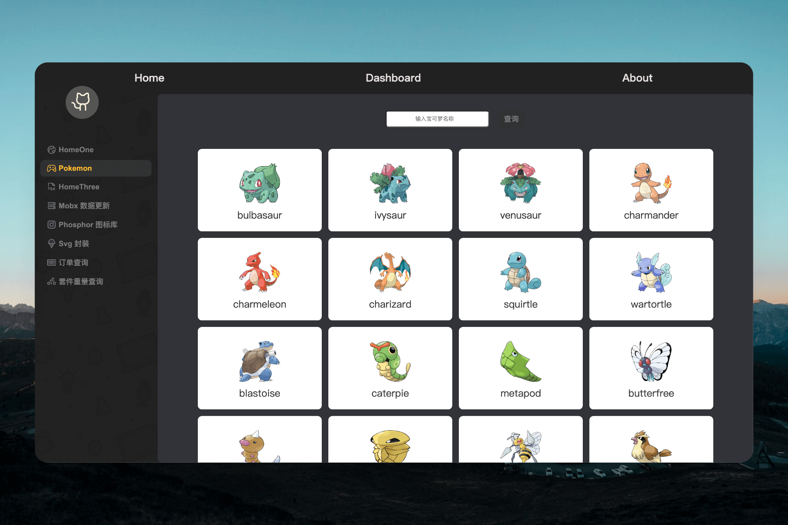

<h1 align="center">React template</h1>
<br/>

<div align="center">
    
</div>
<br>
<p align="center">
    <a href="../README.md">简体中文</a> |  English
</p>

## 🔗 Demo

-   preview [react-enterprise-template](https://guokaigdg.github.io/react-enterprise-template/)

## 👨🏻‍💻 Project Description

-   React template, a more rich template than CRA.

-   Development configuration documentation [React18 + webpack5 + TypeScript4 + react-router-dom](https://juejin.cn/post/7197790401495121977)

-   Project Creation Tutorial [<Building a React Project Development Template from 0 to 1>](https://juejin.cn/post/7223267430231326778)

## 📱 Features

-   📦 Out of the box, no configuration required.
-   📝 Comprehensive comment explanations, low learning cost.
-   🚀 Fast startup and compilation.
-   🌱 Highly customizable, easy to expand.

## 🚀 Technology Stack

[](https://github.com/facebook/react/) [](https://github.com/microsoft/TypeScript)[](https://github.com/facebook/react/) [](https://github.com/axios/axios) [](https://github.com/mobx) [](https://github.com/remix-run/react-router) []()

-   React v18
-   react-dom v18
-   React Hook
-   TypeScript v4
-   webpack v5
-   axios v1
-   mobx v6
-   mobx-react-lite v3
-   react-router-dom v6

## 🎄 Upcoming Features:

-   ① Styles ✅ Submitted on 2023/2/6 [config: 🔧 Add style file (css/less/sass/postCss) processing](https://github.com/guokaigdg/react-enterprise-template/commit/11fb415bac609dfa7474a1ee2db93ccb4a350a51)
-   ② Code specification ✅ Submitted on 2023/2/7 [config: 🔧  Add Prettier/ESlint/StyleLint/EditorConfig code specification](https://github.com/guokaigdg/react-enterprise-template/commit/87dd1ca333f81203dd245a6eb40479a0745f096f)
-   ③ Routing ✅ Submitted on 2023/2/8 [config: 🔧 Add routing management react-router-dom v6](https://github.com/guokaigdg/react-enterprise-template/commit/239446d0709eb52bad2b48af4983eef91c49f60d)
-   ④ Network request ✅ Submitted on 2023/2/21 [feat: ✨  Add network request Axios v1](https://github.com/guokaigdg/react-enterprise-template/commit/27cd67f641d5ecf53b89770195f75bd32bccce46)
-   ⑤ Data sharing ✅ Submitted on 2023/2/13 [feature: ✨  Add state management MobX v6](https://github.com/guokaigdg/react-enterprise-template/commit/992e1884943d4f8bda836f48c60df473418397d7)
-   ⑥ React Hook Rules ✅ Submitted 2023/3/2 [feat: ✨ Added check for React Hook rules](https://github.com/guokaigdg/react-enterprise-template/commit/15346c07a9ffd74f69dd1bb0dd6a4a42aa72df57)
-   ⑦ Encapsulated global SVG componen ✅ Submitted 2023/3/6 [feat: ✨ Encapsulated global SVG component](https://github.com/guokaigdg/react-enterprise-template/commit/066fc6ff28c1ac3b0d6422ebda8d59cdf9275d3a)
-   ⑧ Mobile adaptation ✅ [feat: ✨ Add mobile adaptation solution: postcss px to viewport](https://github.com/guokaigdg/react-enterprise-template/commit/78b10e2d0bada75f4043eaa43aecffb2973fd357)

-   ⑨ Explanation of the differences in the use of Mobx ✅ [feat: ✨ Add explanations and usage examples for makeObservable and makeAutoObservable](https://github.com/guokaigdg/react-enterprise-template/commit/11cee6d4e2f24eebe2d3eec3357d73eca7f9aa8c)

-   ⑩ Mobx react lite optimization ✅ [feat: ✨ Add the use and optimization of observer and observer in mobx react lite](https://github.com/guokaigdg/react-enterprise-template/commit/fe5620b4281e49d44cb25a945a6ba04f125f3f29)

-   ⑪ Add UI design materials ✅ [docs: 📝 Update development design reference documents](https://github.com/guokaigdg/react-enterprise-template/commit/a75a6a705a0e2367dbfcef5e5d562e72b63057df)

## ⌛️ Install project dependencies

-   `npm` >= 6.14.x
-   `node` >= 16.30.x

```
npm
$ npm install

yarn
$ yarn
```

## 🚀 Run the project

```
npm
$ npm run start

yarn
$ yarn dev
```

## 📦 Packaging and compilation

```
npm run build:qa  // Testing environment
npm run build:prod  // Production environment
```

## 🏷 Branch description

| Branch | description        |
| ------ | ------------------ |
| main   | Main branch        |
| deploy | demo deploy        |
| dev    | Development branch |

## Code submission specification

```
git <type>: <subject>
git commit -m "feat: Project initialization"
```

### type 参考:

```
fix       🐛 Bug fix
feature   ✨ Introduce new features
docs      📝 Document writing changes
prune     🔥 Remove code or files
ui        💄 Update UI and style files
perf      ⚡ Performance-related optimizations
rocket    🚀 Deployment function
style     🎨 Style modification
init      🎉 Initial submission
release   🔖 Release version
wip       🚧 Work in progress, and unstable submissions may occur
config    🔧 Modify configuration file
refactot  🔨 Refactoring (code changes that neither add new features nor fix bugs)
merge     🔀 Merge branches
```

## 📂 Directory Structure

```
    ├── .vscode
    │   └──setting.json                 # Configuration for vscode that takes precedence over global settings.json
    ├── doc                             # Development documentation
    ├── webpack                         # Packaging and compilation
    │   └──config                       # Webpack configuration
    │       ├── webpack.common.js       # Base configuration
    │       ├── webpack.dev.js          # Development environment configuration
    │       └──webpack.prod.js          # Production environment configuration
    ├── pubilc
    │   ├──favicon.ico                  # HTML icon
    │   └──index.html                   # HTML entry template
    ├── src
    |   ├── api                         # Interface configuration
    |   ├── assets                      # Static resources
    │   ├── components                  # Common components of the project
    │   ├── http                        # Unified encapsulation of requests
    │   ├── httpinterface               # TypeScript type definition
    │   ├── constData                   # Constant list within the system
    │   ├── router                      # Unified routing entry
    │   ├── store                       # Data sharing
    │   ├── styles                      # Global style
    │   ├── utils                       # Utility library
    │   ├── view                        # Pages
    │   ├── App.tsx                     # Main interface
    │   └──index.tsx                    # Entry file
    ├── .babelrc.js                     # Babel configuration
    ├── .editorconfig                   # Maintaining consistent coding style across editors
    ├── .env.json                       # Environment variable configuration
    ├── .eslintignore                   # Files ignored by ESLint
    ├── .eslintrc.js                    # ESLint configuration
    ├── .gitignore                      # Files ignored by git submission
    ├── .npmrc
    ├── .prettierignore                 # Files ignored by prettierc
    ├── .prettierrc                     # Prettierc configuration
    ├── .stylelintrc.js                 # Code style configuration
    ├── LICENSE                         # Open source license
    ├── package-lock.json               # npm package lock management
    ├── package.json                    # Dependency management
    ├── README.md                       # Project description
    ├── tsconfig.json                   # TypeScript configuration file
    └── yarn.lock                       # Yarn package lock management


```

## 📚 Development reference

-   <a href="./data.md">Development reference</a>

## 🤝 How to Contribute

-   📬 If you have any questions, please open an issue or leave a message
-   🧙‍♀️ Welcome all contributors, come to Issus or submit Pull Requests to become a contributor

## ⭐️ Stargazers

[](https://github.com/guokaigdg/react-enterprise-template/stargazers)

## 💡 Open Source License

The code and documentation of this project are released under the MIT License open source license.
