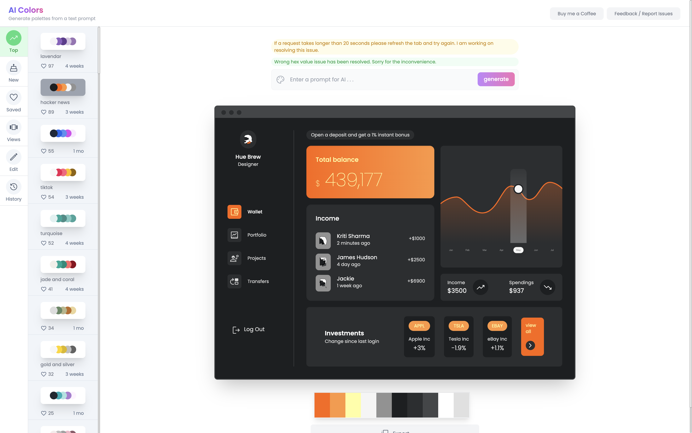
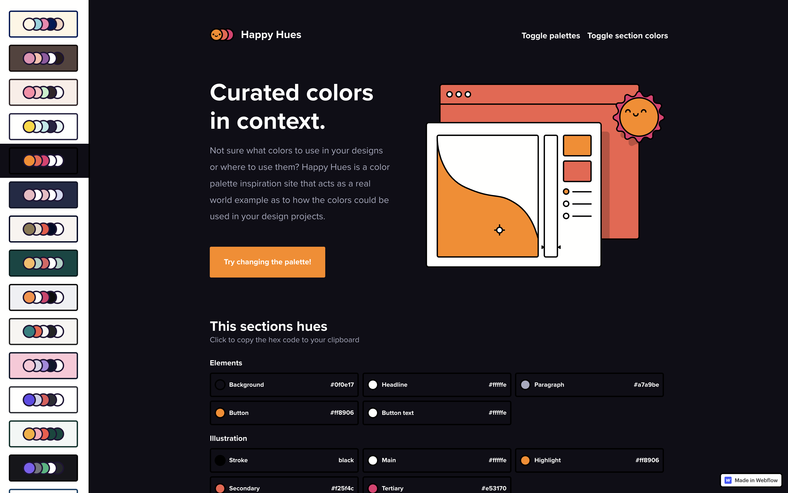
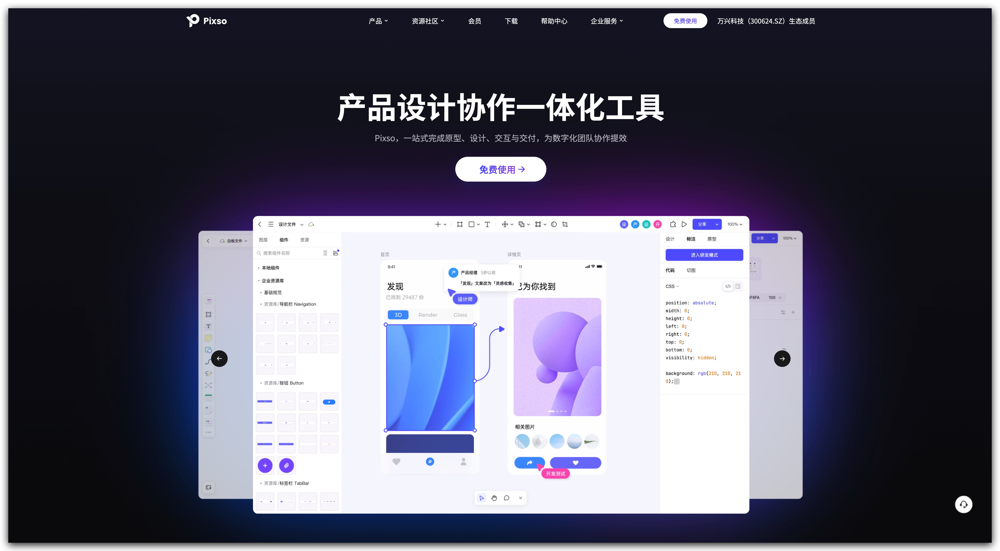
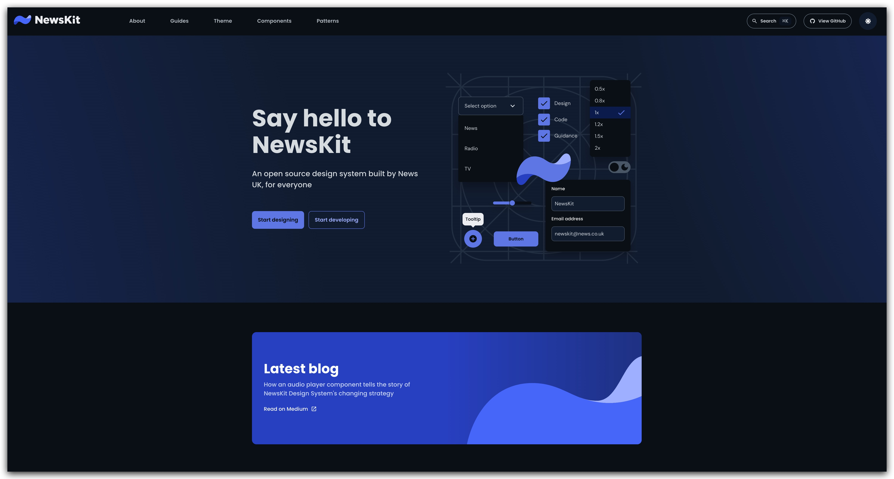
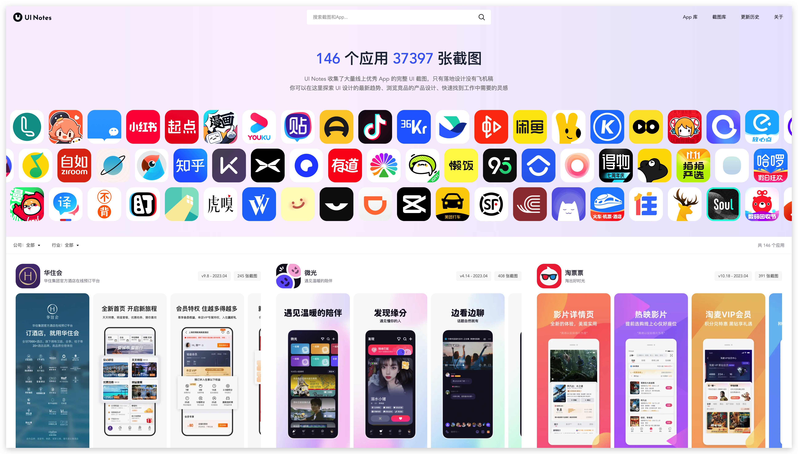
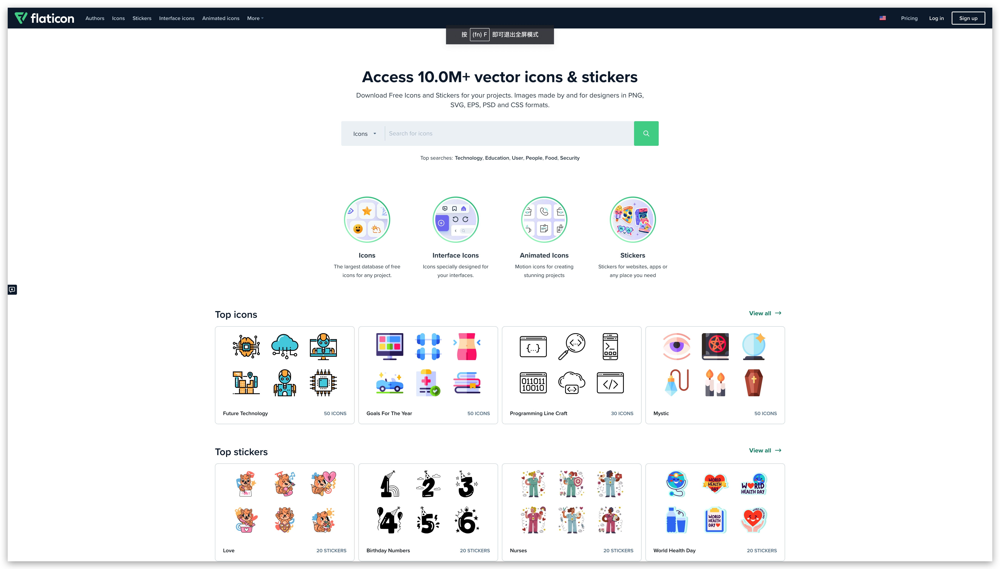
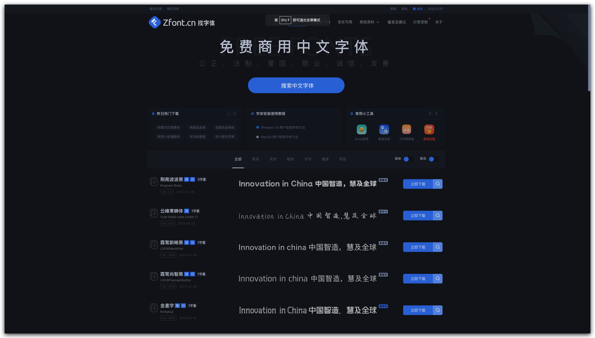
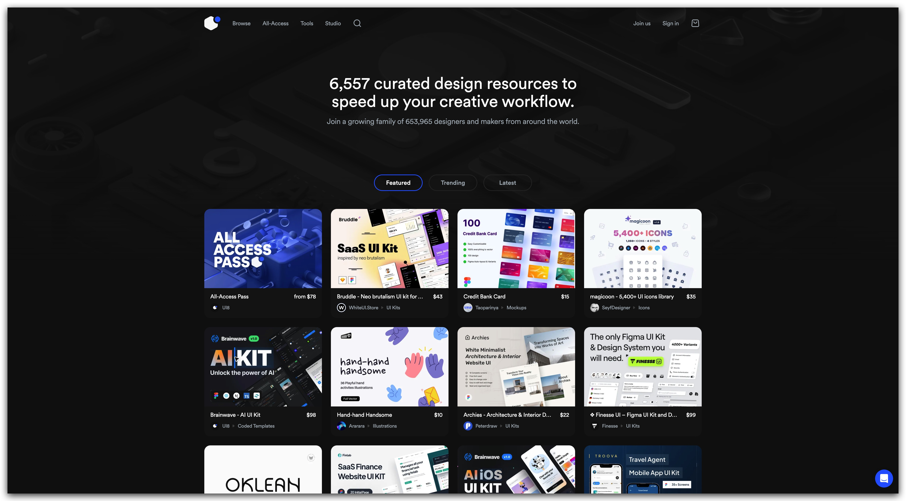
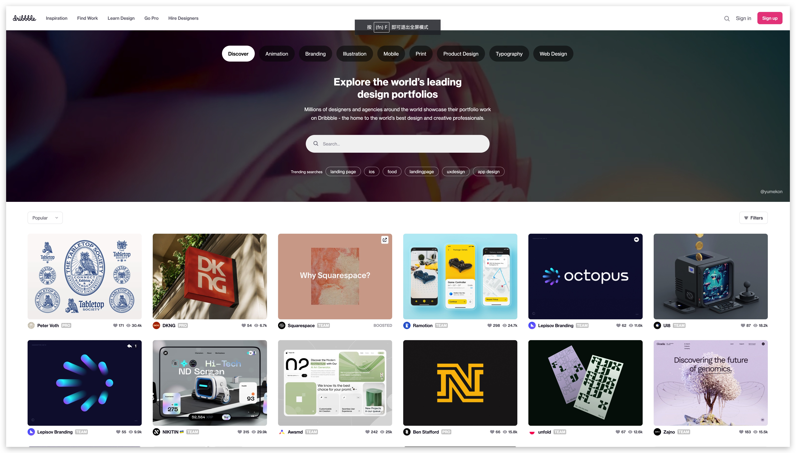

## Web 配色工具「Aicolors」

-   [aicolors.co](https://aicolors.co/)

-   [happyhues](https://www.happyhues.co/palettes/13)

## 设计平台 Pixso

-   [https://pixso.cn/](https://pixso.cn/)
-   产品设计协作一体化工具 Pixso，一站式完成原型、设计、交互与交付，为数字化团队协作提效

-   [https://newskit.co.uk/](https://newskit.co.uk/)
-   由 NewsUK 开发的开源设计系统

## 设计参考 Ui Notes

-   网址[uinotes.com](https://uinotes.com/)

-   UI Notes 收集了大量线上优秀 App 的完整 UI 截图，只有落地设计没有飞机稿, 你可以在这里探索 UI 设计的最新趋势、浏览竞品的产品设计、快速找到工作中需要的灵感

## 图标 flaticon

-   [https://www.flaticon.com/](https://www.flaticon.com/)
-   下载项目的免费图标和贴纸。PNG，SVG，EPS，PSD 和 CSS 格式

## 字体 Zfont

-   [https://zfont.cn/](https://zfont.cn/)
-   免费商用中文字体

## 设计灵感

-   [https://ui8.net/](https://ui8.net/)

-   一个来自世界各地的 653,965 名设计师和制造商的大家庭。

-   [https://dribbble.com/](https://dribbble.com/)

-   探索世界领先的设计作品集世界各地数以百万计的设计师和代理展示他们的作品集在 Dribbble-世界上最好的设计和创意专业人士的家。

